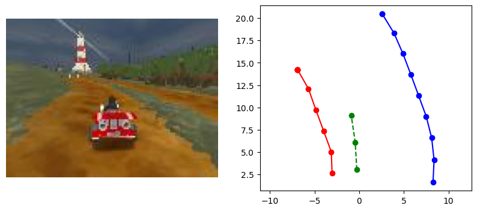

# Homework 4

In this homework, we will learn to drive with MLP, Transformer, and Vision Transformer!

Colab Starter: [link](https://colab.research.google.com/drive/1wRuzQ15Q9-ef2L7Yju-KbAUHo3w1O10i?usp=sharing)

**NOTE:** Even if you're not using Colab, we recommend taking a look at the Colab notebook to see the recommended workflow and sample usage.

## Setup + Starter Code

In this assignment, we'll be using the [SuperTuxKart Drive Dataset](https://www.cs.utexas.edu/~bzhou/dl_class/drive_data.zip) to train our models.

Download the dataset running the following command:
```bash
curl -s -L https://www.cs.utexas.edu/~bzhou/dl_class/drive_data.zip -o ./drive_data.zip && unzip -qo drive_data.zip
```

**NOTE:** Make sure to download a fresh copy of the dataset!
We've added some additional metadata needed for this homework.

Verify that your project directory has the following structure:
```
bundle.py
grader/
homework/
drive_data/
```
You will run all scripts from inside this main directory.

In the `homework` directory, you'll find the following:
- `models.py` - where you will implement various models
- `metrics.py` - metrics to evaluate your models
- `datasets/` - contains loading and data transformations
- `supertux_utils/` - game wrapper + visualization (optional)

## Training
Now you should be all set up.
Next, you'll need to implement
- `homework/train_planner.py`
- `homework/models.py`

As in the previous homework, you will implement the training code from scratch!
This might seem cumbersome modifying the same code repeatedly, but this will help understand the engineering behind writing model/data agnostic training pipelines.

Recall that a training pipeline includes:
* Creating an optimizer
* Creating a model, loss, metrics
* Loading the data
* Running the optimizer for several epochs
* Logging + saving your model (use the provided `save_model`)

### Grader Instructions

You can grade your trained models by running the following command from the main directory:
- `python3 -m grader homework -v` for medium verbosity
- `python3 -m grader homework -vv` to include print statements
- `python3 -m grader homework --disable_color` for Google Colab

## Part 1a: MLP Planner (35 points)

In this part, we will implement a MLP to learn how to drive!
Rather than learning from images directly, we will predict the desired trajectory of the vehicle from the ground truth lane boundaries.

After we have these the desired future trajectory (waypoints), we can use a simple controller to follow the waypoints and drive the vehicle in PySuperTuxKart.

To train this model, we'll use the following data:
* `track_left` - `(n_track, 2)` float, left lane boundaries points
* `track_right` - `(n_track, 2)` float, right lane boundaries points
* `waypoints` - `(n_waypoints, 2)` float, target waypoints
* `waypoints_mask` - `(n_waypoints,)` bool mask indicating "clean" waypoints



For parts 1a/1b, the model will not use the image as input, and instead take in the ground truth `track_left` and `track_right` as input.
You can think of these two planners as having have perfect vision systems and knowledge of the world.

Relevant code:
* `datasets/road_dataset.py:RoadDataset.get_transform`
* `datasets/road_transforms.py:EgoTrackProcessor`

The data processing functions are already implemented, but feel free to add custom transformations for data augmentation.

### Model

Implement the `MLPPlanner` model in `models.py`.

Your `forward` function receives a `(B, n_track, 2)` tensor of left lane boundaries and a `(B, n_track, 2)` tensor of right lane boundaries and should return a `(B, n_waypoints, 2)` tensor of predicted vehicle positions at the next `n_waypoints` time-steps.
Find a suitable loss function to train your model, given that the output waypoints are real-valued.
For all parts in the homework, the number of input boundary points `n_track=10` and the number of output waypoints `n_waypoints=3` are fixed.

For full credit, your model should achieve:
- < 0.2 Longitudinal error
- < 0.6 Lateral error

### Evaluation

We will evaluate your planner with two offline metrics.
Longitudinal error (absolute difference in the forward direction) is a good proxy for how well the model can predict the speed of the vehicle, while lateral error (absolute difference in the left/right direction) is a good proxy for how well the model can predict the steering of the vehicle.

Once your model is able to predict the trajectory well, we can run the model in SuperTuxKart to see how well it drives!

OPTIONAL: To get SuperTuxKart and the visualization scripts running,
```bash
pip install PySuperTuxKartData
pip install PySuperTuxKart --index-url=https://www.cs.utexas.edu/~bzhou/dl_class/pystk

# PySuperTuxKart requires several dependencies and has only been tested on certain systems.
# Check out https://www.cs.utexas.edu/~bzhou/dl_class/pystk/pysupertuxkart/
# for the full list of pre-built supported python versions / OS / CPU architectures.

# If this doesn't work, you can always run your model on Colab,
# or you can trying installing from source https://github.com/philkr/pystk
```

Getting this installed can be tricky and don't worry if you can't get PySuperTuxKart running locally - we'll still be able to evaluate your model when you submit.
Additionally, the offline metrics are a strong proxy for how well the model will perform when actually driving, so if your numbers are good, it will most likely drive well.

If you want to visualize the driving, see the following files in `supertux_utils` module:
* `evaluate.py` - logic on how the model's predictions are used to drive and how the game is run
* `visualizations.py` - matplotlib visualzation of the driving (requires `imageio` to be installed)

Then you can run the following to see how your model drives:
```bash
python3 -m homework.supertux_utils.evaluate --model mlp_planner --track lighthouse
```

See `homework/supertux_utils/evaluate.py` for additional flags.

### Part 1b: Transformer Planner (35 points)

We'll build a similar model to Part 1a, but this time we'll use a Transformer.

Compared to the MLP model, there are many more ways to design this model!
One way to do this is by using a set of `n_waypoints` learned query embeddings to attend over the set of points in lane boundaries.
More specifically, the network will consist of cross attention using the waypoint embeddings as queries, and the lane boundary features as the keys and values.

This architecture most closely resembles the [Perceiver](https://arxiv.org/pdf/2103.03206) model, where in our setting, the "latent array" corresponds to the target waypoint query embeddings (`nn.Embedding`), while the "byte array" refers to the encoded input lane boundaries.


Training the transformer will likely require more tuning, so make sure to optimize your training pipeline to allow for faster experimentation.

For full credit, your model should achieve:
- < 0.2 Longitudinal error
- < 0.6 Lateral error

### Relevant Operations
- [torch.nn.Embedding](https://pytorch.org/docs/stable/generated/torch.nn.Embedding.html)
- [torch.nn.TransformerDecoderLayer](https://pytorch.org/docs/stable/generated/torch.nn.TransformerDecoderLayer.html)
- [torch.nn.TransformerDecoder](https://pytorch.org/docs/stable/generated/torch.nn.TransformerDecoder.html)

## Part 2: Vision Transformer Planner (30 points)

One major limitation of the previous models is that they require the ground truth lane boundaries as input.
In the previous homework, we trained a model to predict these in image space, but reprojecting the lane boundaries from image space to the vehicle's coordinate frame is non-trivial as small depth errors are magnified through the re-projection process.

Rather than going through segmentation and depth estimation, we can learn to predict the lane boundaries in the vehicle's coordinate frame directly from the image!

You will need to implement the `ViTPlanner` model in `models.py` to predict waypoints from images. You can reuse the `TransformerBlock` you implemented in homework 3.

Your `forward` function receives a `(B, 3, 96, 128)` image tensor as input and should return a `(B, n_waypoints, 2)` tensor of predicted vehicle positions at the next `n_waypoints` time-steps.

For full credit, your model should achieve:
- < 0.30 Longitudinal error
- < 0.45 Lateral error

## Submission

Create a submission bundle (max size **60MB**) using:
```bash
python3 bundle.py homework $YOUR_UT_ID
```

If you notice that your bundle is too large, you can modify the `bundle.py` script and ignore large files by adding them manually to `BLACKLIST`.

Please double-check that your zip file was properly created by grading it again.
```bash
python3 -m val_grader $YOUR_UT_ID.zip
```
After verifying that the zip file grades successfully, you can submit it on Canvas.
