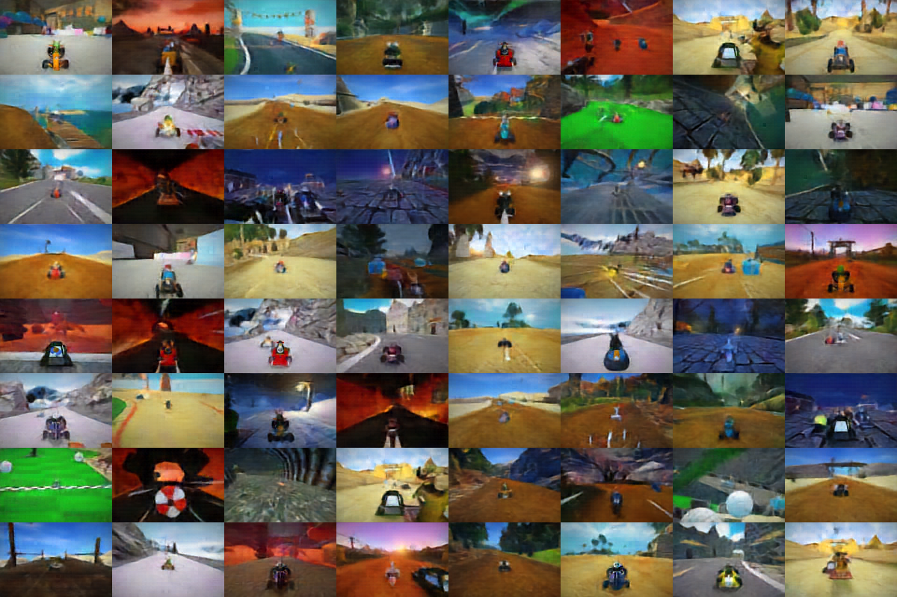
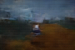
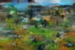

# Homework 5 - Auto-regressive image generation

In this homework, we will train an auto-regressive image generation model from scratch on a dataset up supertuxkart images [here](https://utexas.box.com/shared/static/qubjm5isldqvyimfj9rsmbnvnbezwcv4.zip).
The final model is both a generative model, and an image compressor.

The homework consists of five parts (one optional):

1. Train a patch-level auto-encoder `ae.py`
2. Convert your auto-encoder into a quantizer `bsq.py` using Binary Spherical Quantization
3. Convert the training and validation sets into their tokenized form and train an auto-regressive model
4. Generate samples from the auto-regressive model
5. (Optional) Use the auto-regressive model to compress your images.

Familiarize yourself with the starter code, download and unzip the data.

```bash
wget https://utexas.box.com/shared/static/qubjm5isldqvyimfj9rsmbnvnbezwcv4.zip -O supertux_data.zip
unzip supertux_data.zip
```

We provide dataloaders for the image dataset, and tokenized versions of the dataset in `data.py`.
We also provide a full training script including logging in `train.py`.
To train any model you define in `ae.py`, `autoregressive.py`, or `bsq.py` simply call:

```bash
python -m homework.train NameOfTheModel
```

Feel free to optionally provide `--epochs ..` (to train for longer) or `--batch_size` (to manage memory).
The trainer will produce two files/directories:

- `logs/{date}_{NameOfTheModel}` a tensorboard log (call `tensorboard --logdir logs` to see all logs)
- `checkpoints/{date}_{NameOfTheModel}.pth` the actual model trained

Finally, we provide the tokenization script (`tokenize.py`) that converts a set of images into a torch tensor of tokens.

## Grading Criteria

The grading criteria are part-specific and explained below.
There are 5 pts extra credit to implement compression using the auto-regressive model and entropy coding.

## Patch-level auto-encoder (30 pts)

We start by implementing the patch-level auto-encoder.
The goal here is to take an image of size W=150 x H=100 pixels and split it into equal-sized patches of size PxP (anything from P=5 to P=25 will work here).
For each patch, we compute a d-dimensional embedding using a non-linear function.
The result is an image of size w x h x d image of features.
A decoder then maps these features back into the original image space.

Architecturally almost anything will work here. Use this part of the assignment to get used to the training code, and get warmed up.
Even a linear encoder and decoder work here.

Train your network by calling:

```bash
python -m homework.train PatchAutoEncoder
```

## Patch-level Quantizer (30 pts)

In this part, we implement a simplified version of [Binary Spherical Quantization (BSQ)](https://arxiv.org/abs/2406.07548).
BSQ uses a binary bottleneck of size C where each feature is either -1 or 1. This binary code directly corresponds to an integer token. See `BSQ._code_to_index` and `BSQ._index_to_code` for functions that map a binary vector to an integer feature.
We provide a differentiable binarization function `diff_sign` in `bsq.py`. It allows for a -1 / 1 quantization and uses a straight-through gradient estimator.
Using this function directly in a binary bottleneck likely will not work (see BSQ paper for baselines, or feel free to train it yourself).
However, simply normalizing the inputs to the binarization using an L2-norm will lead to a fairly easy-to-train and efficient quantizer.
Finally, BSQ projects auto-encoder features down to a lower-dimensional bottleneck (also called codebook dimension), then normalizes, quantizes, and projects everything back into the original space.

BSQ optimizes several losses in addition to reconstruction (entropy, commitment, GAN, etc).
For this assignment, you can safely ignore all other losses, a simple differentiable sign and normalization should suffice.

In this part, you should combine your auto-encoder from part 1 with the BSQ quantizer.
It is highly recommended to follow the hyper-parameters set out in the starter code `patch_size=5` and `codebook_bits = 10`, this will make later parts easier.

Train your network by calling:

```bash
python -m homework.train BSQPatchAutoEncoder
```

Make sure to fire up tensorboard `tensorboard --logdir logs` to monitor your training.

A well-trained quantizer will look like this:



The above quantizer was trained for an hour in a single GPU.
It introduces some artifacts, due to limited training, and using just an L2 loss, but anything close to this will suffice for the homework.
If your quantizer is blocky, or blurry don't worry, you will still be able to complete the assignment. Training a successful quantizer can take as little as 5min on an entry-level GPU.

With the `BSQPatchAutoEncoder` trained, let's create a token-level dataset for the next part.

```bash
python -m homework.tokenize checkpoints/YOUR_BSQPatchAutoEncoder.pth data/tokenized_train.pth data/train/

python -m homework.tokenize checkpoints/YOUR_BSQPatchAutoEncoder.pth data/tokenized_valid.pth data/valid/
```

This will create two files `data/tokenized_train.pth` and `data/tokenized_valid.pth` containing the entire training and validation datasets.

If you're curious, check the tokenized checkpoint size:

```
du -hs data/tokenized_train.pth
```

If you follow the hyper-parameters above, it should be around 76Mb (compared to 500Mb for the original JPG dataset).
This is already a great compression result, but we will be able to get it down further.

## Auto-regressive model (30 pts)

Finally, we will train an auto-regressive model.
It takes a batch of the tokenized image as input and produces a distribution over next tokens as output.

Design your `AutoregressiveModel` in `autoregressive.py`.
Many models work here, but a decoder-only transformer might be the easiest.
As with the quantizer above, you will not require a large network to pass this assignment.
We recommend using `torch.nn.TransformerEncoderLayer` (not a typo) with a causal mask `torch.nn.Transformer.generate_square_subsequent_mask`.
For this to work, you should flatten your input image into a sequence first.
You'll need to take care handling the auto-regressive prediction: The output at location (i, j) should not see the input token at location(i, j) which should predict and only see tokens preceding it.
You may use a positional embedding, but this is optional.

Once your network is ready, train it using the next-token cross-entropy loss.

```bash
python -m homework.train AutoregressiveModel
```

Fun fact: The cross-entropy corresponds to the compression rate an arithmetic coding algorithm can obtain using your model.

Your model should be able to reach an average of 4500 bits per image quite easily.
A well-trained model can go as low as 4000 bits per image (500 bytes, an order of magnitude smaller than JPG, although not at the same quality).

## Generation (10 pts)

Finally, produce samples from your generative model by implementing `AutoregressiveModel.generate`.
Since our model is quite small, and the tokenizer is lossy, don't expect great generation results.

Here are samples from a model without positional embedding

  

As you can see, they mostly capture co-occurrence statistics of patches (within a level).

With a positional embedding, the results look slightly better, but still far from great:

  

To generate your own samples use

```
python3 -m homework.generation checkpoints/YOUR_TOKENIZER checkpoints/YOUR_AUTOREGRESSIVE_MODEL N_IMAGES OUTPUT_PATH
```

If you trained your model for only a few (even one works) epochs, the generations may look like this:

  

Getting better generations will require:

1. A better Quantizer (smaller patches or higher bitrates)
2. A much larger transformer
3. Longer training

## Extra credit: Compression (5 pts)

If you want to challenge yourself, try implementing the `Compressor.compress` and `Compressor.decompress` functions in `compress.py`.

## Checkpoints
During training, model checkpoints will be automatically saved in the checkpoints/ directory. The latest trained model will also be saved in the homework/ directory and will be used for grading.

If you wish to submit a specific checkpoint instead of the most recent one, you can manually copy the desired checkpoint from checkpoints/ into homework/, overwriting the existing model file. This ensures that the grader evaluates your preferred checkpoint.

For example, if you trained an AutoregressiveModel on 2025-02-27 and want this checkpoint to be graded, run:

```bash
cp checkpoints/2025-02-27_AutoregressiveModel.pth homework/AutoregressiveModel.pth
```

## Apple Silicon (MPS) and Bitwise Operations Bug

During the implementation of Binary Spherical Quantization (BSQ), we encountered a bug related to bitwise operations on Apple Silicon (MPS) in PyTorch. Specifically, bit shifting operations (<< and >>) do not work correctly when executed on an MPS-enabled device.

This issue is tracked in the PyTorch repository:
[PyTorch Issue #147889](https://github.com/pytorch/pytorch/issues/147889)

To work around this issue, we have implemented a custom bitwise operation using the `diff_sign` function. This function provides a differentiable approximation of the sign function, which is equivalent to the bitwise operation in the reference implementation.

Workaround:
Instead of using bit shifting (x << n), we strongly recommend using exponentiation of 2 (x * (2 ** n)) to ensure compatibility across different hardware.

Example:
Instead of:

```python
index = (binary_code << torch.arange(codebook_bits))
```

Use:

```python
index = (binary_code * (2 ** torch.arange(codebook_bits)))
```

This will avoid computation errors when running the BSQ model on Apple Silicon (e.g., M1, M2, M3).

## Submission

Once you finished the assignment, create a submission bundle using:

```bash
python3 bundle.py homework [YOUR UT ID]
```

Submit the zip file on Canvas. Please note that the maximum file size our grader accepts is **20MB**. Please keep your solution compact.
Please double-check that your zip file was properly created, by grading it again:

```bash
python3 -m grader [YOUR UT ID].zip
```

## Online grader

We will use an automated grader through Canvas to grade all your submissions. There is a soft limit of **5** submissions per assignment. Please contact the course staff before going over this limit, otherwise your submission might be counted as invalid.

The online grading system will use a slightly modified version of Python and the grader:

- Please do not use the `exit` or `sys.exit` command, it will likely lead to a crash in the grader
- Please do not try to access, read, or write files outside the ones specified in the assignment. This again will lead to a crash. File writing is disabled.
- Network access is disabled. Please do not try to communicate with the outside world.
- Forking is not allowed!
- `print` or `sys.stdout.write` statements from your code are ignored and not returned.

Please do not try to break or hack the grader. Doing so will have negative consequences for your standing in this class and the program.

## Installation

We encourage using [Miniconda](https://docs.conda.io/en/latest/miniconda.html) to install the required packages.

```bash
conda create --name cs342_hw5 python=3.12 -y
conda activate cs342_hw5
```

First, install [PyTorch](https://pytorch.org/get-started/locally/)

Then install additional dependencies:

```bash
pip install -r requirements.txt
```
